# BPM – Procedural Materials for Blender

178 ready-made materials for Blender — **bare metal, painted metal, military paint and
camouflage, wood, plastic, glass, lenses and visors, leather, fabric & composites (carbon
fiber, kevlar, ballistic nylon…), and H.R. Giger-style biomechanical surfaces** — plus 26
**overlays (dirt, dust, edge wear and scratches)** that you can stack on top of *any*
material, and **decals**: put any image (with its normal, roughness, metallic and height
maps if it has them) on your model by dragging a box over it. Every material has plain sliders you can tweak, and
one click on **Auto Texture** turns it into normal image textures (Base Color,
Metallic, Roughness, Normal, Height, AO) for game engines or any other software: it
unwraps the UVs, packs them, bakes, saves the files and puts the textures on the
object — for one object, the selected ones or the whole scene.

You don't need to know anything about nodes, UVs or procedural materials. Click a
material, click **Apply**, move some sliders, click **Auto Texture**.

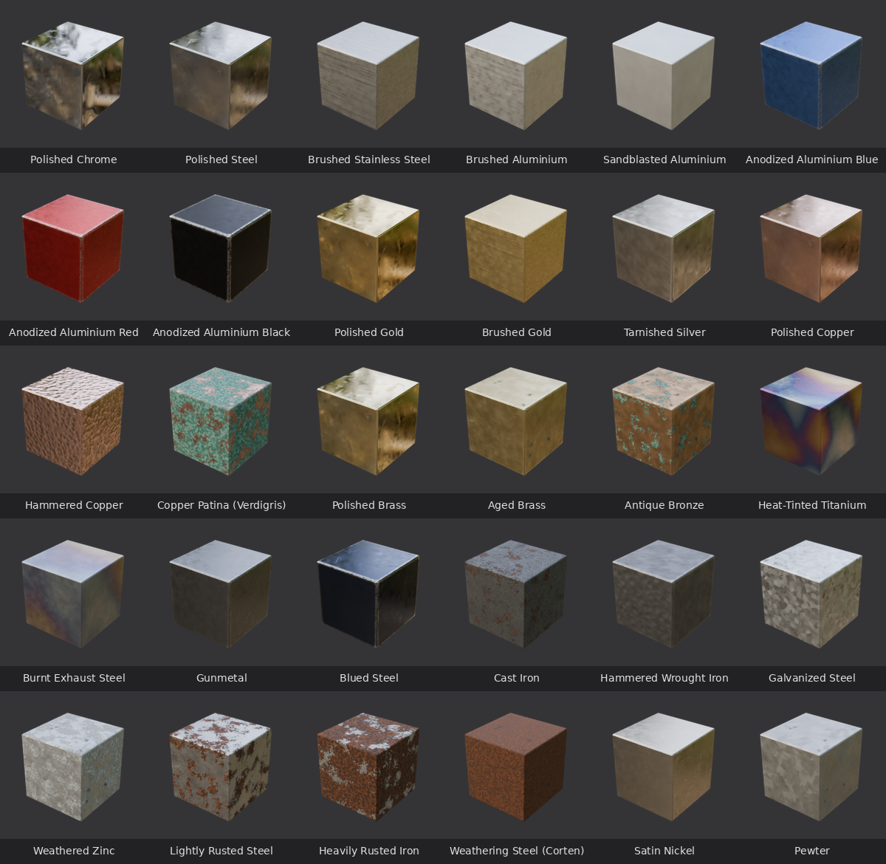
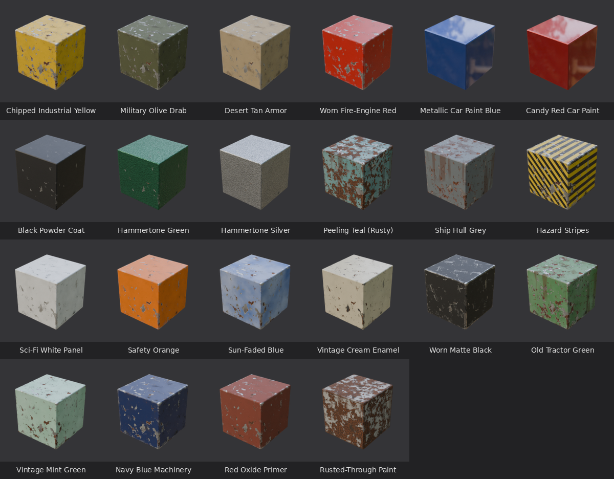
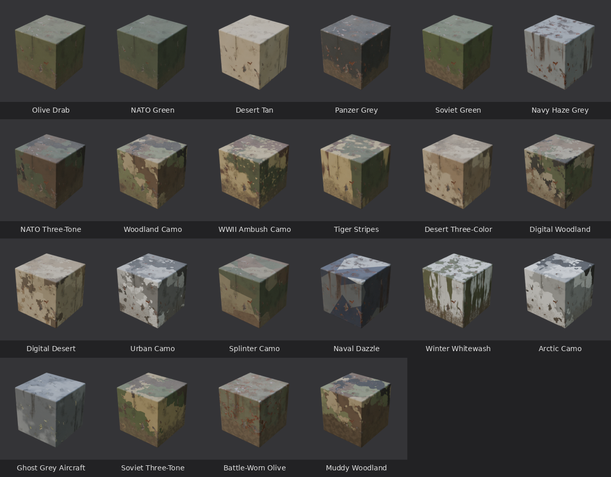
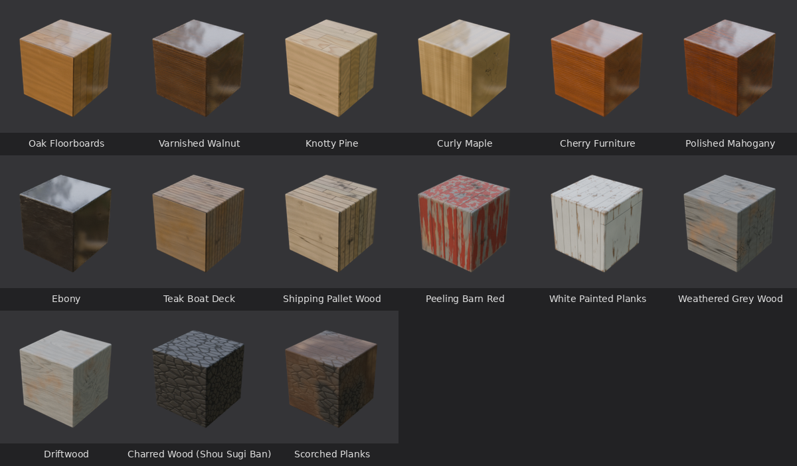
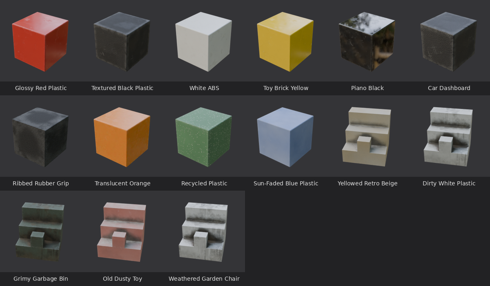
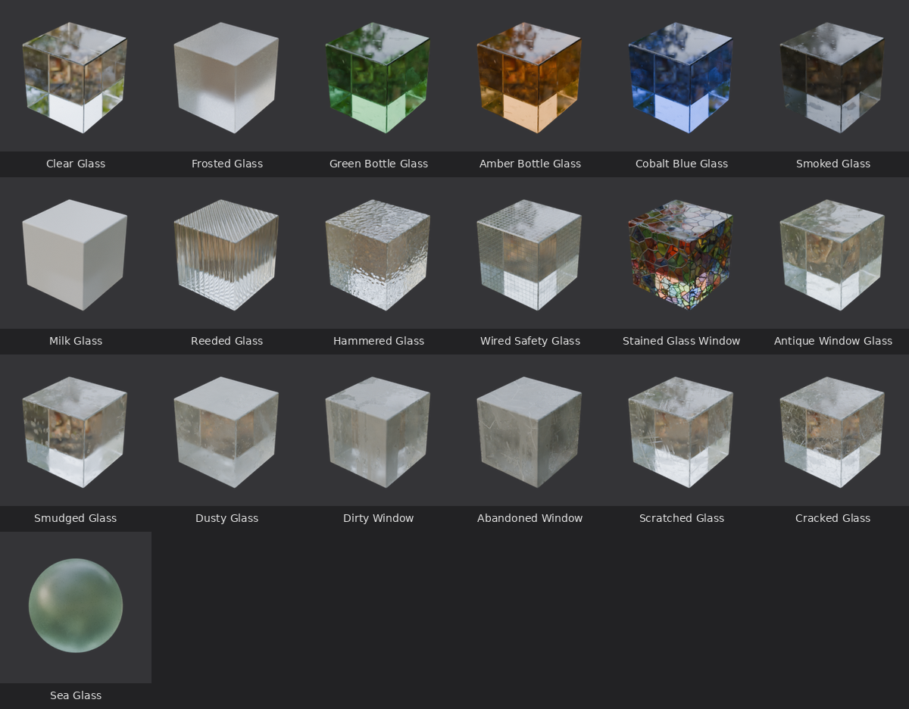
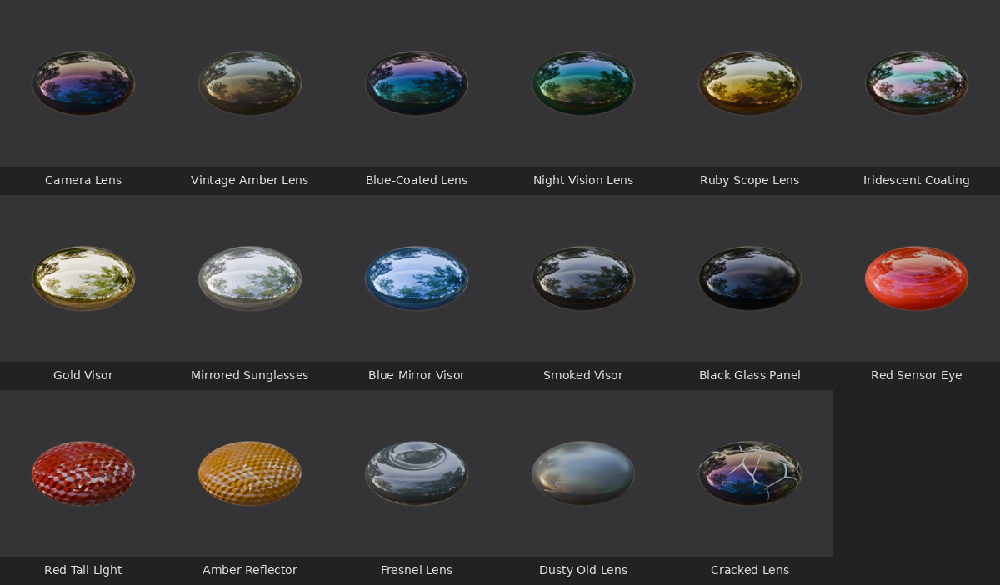
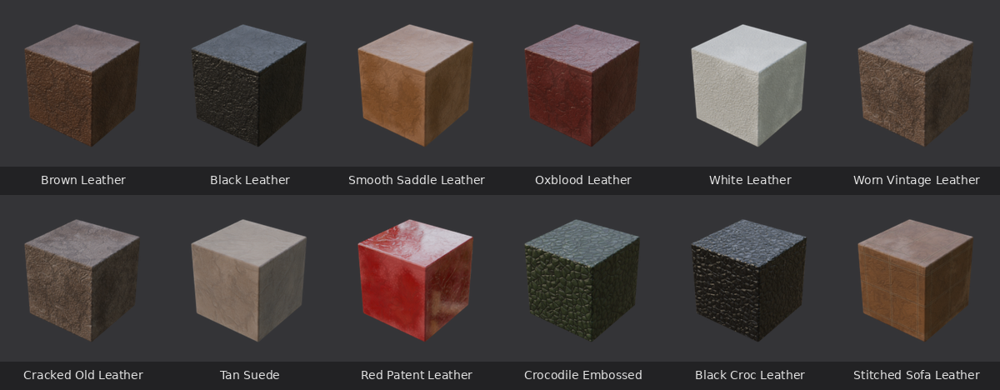
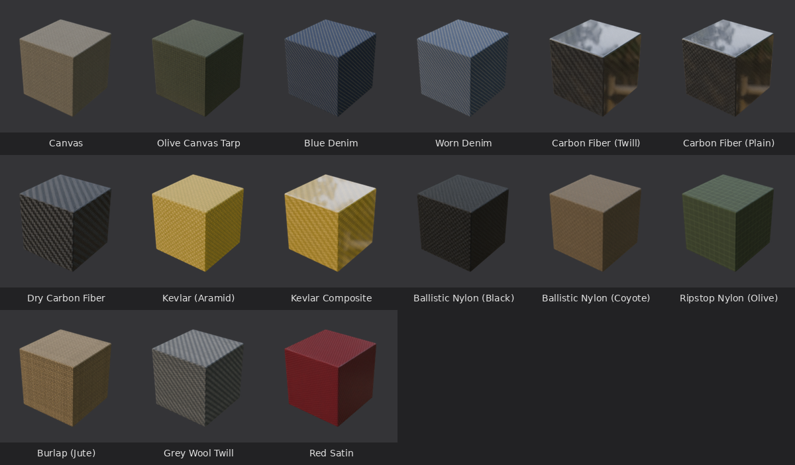
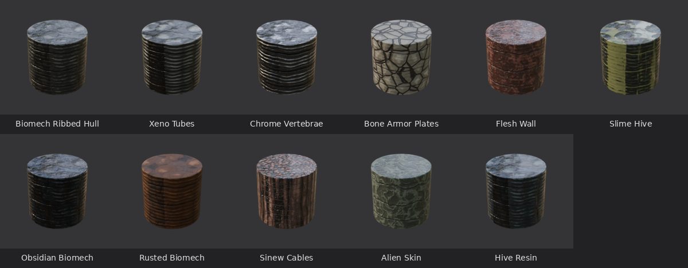
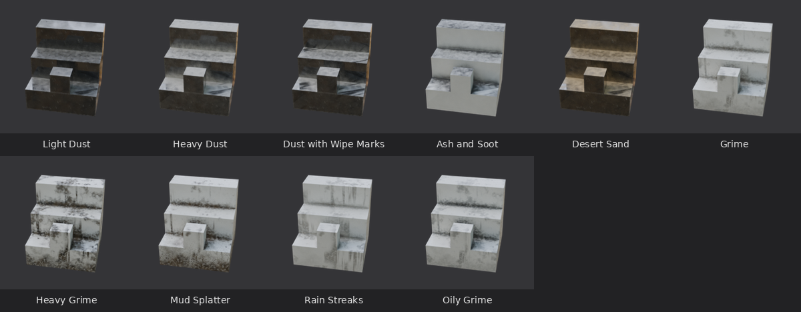
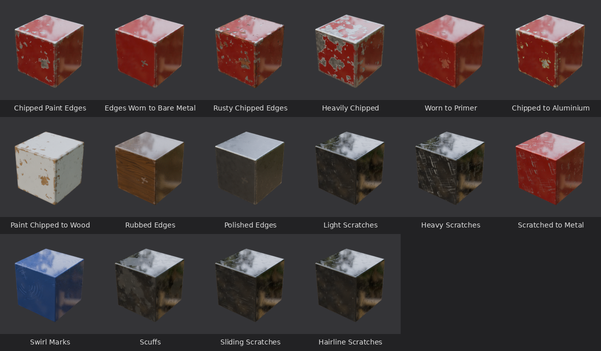

Works with **Blender 4.2 or newer**. Tested on Blender 4.2 LTS, 4.5 LTS and 5.2 LTS
on Linux; it is pure Python, so Windows and macOS work the same way.

---

## 1. Install (once)

1. Download **[`dist/bpm_procedural_metals-1.4.0.zip`](dist/bpm_procedural_metals-1.4.0.zip)**
   (on GitHub, click the file, then the download button). **Don't unzip it.**
2. Open Blender and go to **Edit › Preferences › Get Extensions**.
3. Click the small **⌄ arrow** in the top-right corner and pick **Install from Disk…**
4. Select the zip file. Done: "BPM - Procedural Materials" now shows up as enabled.

> **Updating from an older version (1.0 – 1.3)?** Just install the new zip the same
> way, on top of the old one: it replaces the old version (no need to uninstall first
> or restart Blender), and your `.blend` files keep their materials and settings.

> Shortcut: you can also just drag the zip file into the Blender window.

## 2. Use it

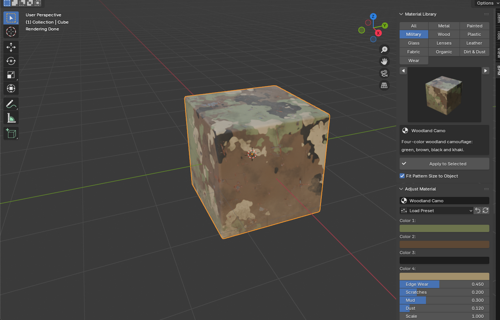

1. In the 3D view, **click your object** to select it.
2. Press **N** (with the mouse over the 3D view) to open the sidebar and click the
   **BPM** tab.
3. Pick a category (Metal, Military, Wood, Glass, Lenses, Fabric, Dirt & Dust, Wear…),
   click the big picture to see its materials, pick one, then click
   **Apply to Selected**.
4. To see the material, switch the viewport to **Material Preview**: press **Z** and
   choose *Material Preview* (or click the third sphere icon at the top right of the
   3D view).
5. Change the look in **Adjust Material**. The most useful sliders are at the top;
   click the section names (*Base*, *Wear*, *Aging*, …) to see more.
   * **Scale** makes all the details bigger or smaller.
   * **Seed** (or the 🔄 button) gives a new random variation.
   * The ↶ button resets everything to the original preset.

In Edit Mode, *Apply* puts the material only on the **selected faces**.

### Dirt, dust, edge wear and scratches on top of anything

Two categories hold overlays, layers that go on top of another material:

* **Dirt & Dust** – grime, heavy grime, mud splatter, rain streaks, oily grime,
  light / heavy dust, dust with wipe marks, ash and soot, desert sand.
* **Wear** – edge wear (paint chipped to grey primer and steel, to bare shiny metal,
  rusty chips, heavy chips, worn to red primer, aircraft-style zinc chromate and
  aluminium, paint chipped to wood, edges just rubbed lighter for wood, leather or
  plastic, polished edges for metal) and scratches (light, heavy, through the paint to
  the metal, swirl marks, scuffs, scratches all in one direction, fine hairlines).

Picking one shows **Add on Top of Material** instead of *Apply*: the layer goes on top
of whatever material the object already has — a BPM material or any other material
that uses a Principled BSDF (most do). The **Add Overlay** button in the overlays
panel lists them all too.

The **Overlays** panel lists the layers of the active object's material:

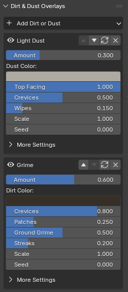

* the 👁 button hides / shows a layer (compare with and without),
* the arrows change the order (the top layer covers the ones below),
* 🔄 gives the layer a new random variation, ✕ removes it,
* the sliders control how much dirt there is and where it goes: *Crevices* (corners
  and gaps), *Ground Grime* (rising from the bottom of the object), *Streaks*,
  *Splatter*, *Top Facing* (dust settles on top), *Wipes*, *Wetness*, *Fill* (how much
  the layer hides the relief below)…
* edge wear has *Amount*, *Edge Width* and *Chips* (all over), what shows through
  (*Underneath Color*, *Metallic*, *Roughness*, *Primer*) or *Rubbed* for edges that are
  only worn lighter; scratches have *Amount*, *Fine Scratches*, *Swirls*, *Scuffs*,
  *Straight* (all one way) and *Reveal* (cut through to the metal or just lighten).
  Edge wear needs Cycles or a bake to show, like all edge effects.

Overlays are baked into the textures automatically, in both bake modes. Some
materials (for example *Dirty White Plastic* or *Olive Canvas Tarp*) come with an
overlay already; it shows up in the panel like any other layer.

### Decals: logos, stencils, signs

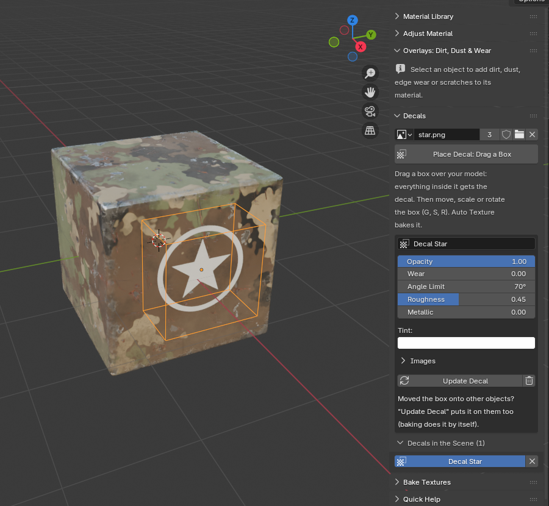

1. In the **Decals** panel, click **Open** and pick an image (a PNG with a transparent
   background works best). PBR maps saved next to it with the same name are used too:
   `Logo_Normal.png`, `Logo_Roughness.png`, `Logo_Metallic.png`, `Logo_Height.png`
   (and the image itself may be called `Logo_BaseColor.png`).
2. Click **Place Decal: Drag a Box** and drag a rectangle over your model in the 3D view.
   A box is made on the surface under the rectangle, and everything inside the box gets
   the decal. You can still orbit and zoom while placing; right-click or Esc cancels.
3. The box is selected: **move** (G), **scale** (S) or **rotate** (R) it, and the decal
   follows. Surfaces turned away from the box don't get it (*Angle Limit*), so it doesn't
   smear down the sides.
4. The panel shows its settings: *Opacity*, *Wear* (chipped away, like an old stencil),
   *Angle Limit*, *Roughness* and *Metallic* (when it has no maps for them), *Normal
   Strength*, *DirectX Normal Map*, *Relief*, *Tint*, and its images.
5. **Auto Texture** bakes decals into the textures like everything else. If you moved a
   box onto another object, baking puts the decal on it by itself (or click
   **Update Decal**).

A decal is a layer of the material, listed with the overlays as *Decal: …*: dirt or dust
added afterwards goes on top of it, and the arrows move it up or down; ✕ there takes it
off that one material (until you click **Update Decal**). The trash button in the
Decals panel deletes a decal (deleting its box does too); duplicating a box (Shift+D)
makes a second decal. The `.blend` file keeps its decals even on a computer without BPM.

## 3. Turn it into textures

Open the **Bake Textures** panel (scroll down in the BPM tab) and choose a mode:

| Mode | What you get | Use it for |
|---|---|---|
| **Objects** | Textures that fit your objects' UVs, including edge wear and dirt from their shape | Exporting a model to Unity, Unreal, Godot, Sketchfab, glTF/FBX… |
| **Seamless Tile** | Square textures of the active material that repeat with no visible seams | Texture libraries, walls, floors, other 3D programs |

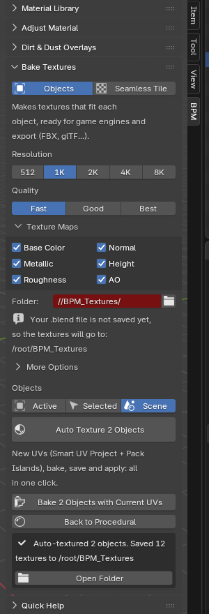

### Auto Texture: everything in one click

1. Pick a **Resolution** (2K is a good start) and **Quality**.
2. Pick which **Objects**: **Active** (just the one you clicked last), **Selected**
   (all selected objects) or **Scene** (every visible mesh in the scene).
3. Click **Auto Texture**. For every object it:
   1. unwraps the UVs with **Smart UV Project** (Blender's default settings),
   2. packs them with Blender's own **Pack Islands** (with a small gap between the
      pieces, so colors don't bleed),
   3. bakes every ticked map,
   4. saves the textures as PNG files,
   5. switches the object to a material that uses them.

The status bar at the bottom shows the progress; press **Esc** to cancel (objects that
were already finished keep their textures; the others stay exactly as they were).
**Ctrl+Z** undoes the whole thing.

* **Where are the files?** In a `BPM_Textures` folder next to your `.blend` file.
  If you never saved the `.blend` file, they go to `BPM_Textures` in your home
  folder. Click **Open Folder** after baking.
* **The new UVs** go into a UV map called `BPM_Bake`. It becomes the *first* UV map, so
  FBX / glTF exports and game engines (which read the first one) use it. Your old UV
  maps stay, untouched.
* **Your procedural material is kept**: click **Back to Procedural** to keep editing,
  then click Auto Texture again any time. *Use Baked Textures* switches back.
* **Linked duplicates** (Alt+D copies that share a mesh and material) share one set of
  textures. Objects with no material, or that can't be baked, are skipped; the reason
  is listed under the result.
* It works for **any** material that uses a Principled BSDF, not only BPM ones.

### Bake with Current UVs

**Bake with Current UVs** does the same, but keeps the UVs your objects already have —
for models you unwrapped by hand. Objects without UVs (or with broken or overlapping
UVs) still get a new `BPM_Bake` UV map automatically.

Files (for an object called `Crate`):

| File | Content | Color space in other programs |
|---|---|---|
| `Crate_BaseColor.png` | Color | sRGB |
| `Crate_Metallic.png` | White = metal, black = paint, rust, dirt | Linear / non-color |
| `Crate_Roughness.png` | White = matte, black = glossy | Linear / non-color |
| `Crate_Normal.png` | Surface detail (normal map) | Linear / non-color, type *Normal map* |
| `Crate_Height.png` | Height (16-bit) for parallax/displacement | Linear / non-color |
| `Crate_AO.png` | Soft shadows in crevices | Linear / non-color |
| `Crate_Transmission.png` *(glass only)* | White = see-through, black = opaque (dirt, lead, wire) | Linear / non-color |
| `Crate_Opacity.png` *(glass only)* | The same, inverted, for an engine's alpha / opacity | Linear / non-color |
| `Crate_ORM.png` *(option)* | R = AO, G = Roughness, B = Metallic | Linear / non-color |
| `Crate_MetallicSmoothness.png` *(option)* | Unity: RGB = Metallic, A = Smoothness | Linear / non-color |

### Game engine cheat sheet

* **Unreal Engine** – in *More Options* choose **Normal Map Format: DirectX** and tick
  **Packed ORM**. Connect ORM red to *Ambient Occlusion*, green to *Roughness* and blue
  to *Metallic*, and turn **sRGB off** for the ORM texture.
* **Unity** – keep **OpenGL** normals, tick **Unity Metallic/Smoothness** and use it as
  the *Metallic Map* (Source: Metallic Alpha). Set the normal texture's type to *Normal map*.
* **Godot 4** – keep **OpenGL** normals. Use the maps directly, or the ORM texture with
  an *ORMMaterial3D*.
* **glTF / GLB export from Blender** – just export: the baked material, including AO,
  is set up so the glTF exporter picks everything up (glass too: transmission and IOR).
* **Glass in Unity / Unreal / Godot** – make the material transparent (translucent) and
  use `_Opacity.png` as its alpha / opacity.

### More options

* **Normal Map Format** – OpenGL (Blender, Unity, Godot, glTF) or DirectX (Unreal).
* **Bit Depth** – 16-bit PNGs are smoother but bigger (Height is always 16-bit).
* **Use Baked Material** / **Auto UV Unwrap** – for *Bake with Current UVs* (Auto
  Texture always unwraps and always switches to the textures).
* **Device** – *Auto* uses your graphics card if it is set up in
  *Edit › Preferences › System › Cycles Render Devices*; otherwise the CPU.
* **Tile Size** – how many meters of surface one seamless tile shows.

## 4. The materials

**Bare metal (30):** polished chrome, steel, brushed stainless steel, brushed and
sandblasted aluminium, anodized aluminium (blue, red, black), polished and brushed
gold, tarnished silver, polished, hammered and verdigris copper, polished and aged
brass, antique bronze, heat-tinted titanium, burnt exhaust steel, gunmetal, blued
steel, cast iron, hammered wrought iron, galvanized steel, weathered zinc, lightly
rusted steel, heavily rusted iron, Corten weathering steel, satin nickel, pewter.

**Painted metal (22):** chipped industrial yellow, military olive drab, desert tan,
worn fire-engine red, metallic car paint (blue, candy red), black powder coat,
hammertone (green, silver), peeling teal, ship hull grey, hazard stripes, sci-fi
white, safety orange, sun-faded blue, vintage cream enamel, worn matte black, old
tractor green, vintage mint, navy machinery, red oxide primer, rusted-through paint.

**Military (22):** plain colors (olive drab, NATO green, desert tan, panzer grey,
Soviet green, navy haze grey) and camouflage schemes (NATO three-tone, woodland,
WWII ambush, tiger stripes, desert three-color, digital woodland and desert, urban,
splinter, naval dazzle, winter whitewash, arctic, ghost grey aircraft, Soviet
three-tone, battle-worn olive, muddy woodland). Mud, dust, grime, rain streaks, edge
wear, chips, scratches, primer and rust are built in: every one has its own slider.

**Wood (15):** oak floorboards, varnished walnut, knotty pine, curly maple, cherry,
polished mahogany, ebony, teak boat deck, shipping pallet, peeling barn red, white
painted planks, weathered grey wood, driftwood, charred wood (shou sugi ban),
scorched planks.

**Plastic (15):** glossy red, textured black, white ABS, toy brick yellow, piano
black, car dashboard (leather grain), ribbed rubber grip, translucent orange,
recycled (flecked), sun-faded blue — and the dirty ones: yellowed retro beige, dirty
white plastic, grimy garbage bin, old dusty toy, weathered garden chair.

**Glass (19):** clear, frosted, green bottle, amber bottle, cobalt blue, smoked, milk
glass, reeded, hammered, wired safety glass, stained glass window, antique window
glass — and the worn and grimy ones: smudged, dusty, dirty window, abandoned window,
scratched, cracked, sea glass.

**Lenses & visors (17):** reflective, glossy surfaces you can't see through: camera
lens (purple and green coating), vintage amber lens, blue-coated lens, night vision
lens, ruby scope lens, iridescent (dichroic) coating, gold visor, mirrored sunglasses,
blue mirror visor, smoked visor, black glass panel, red sensor eye, red tail light and
amber reflector (with prisms), Fresnel lens, dusty old lens, cracked lens.

**Leather (12):** brown, black, smooth saddle, oxblood, white, worn vintage, cracked
old leather, tan suede, red patent, crocodile embossed (green, black), stitched sofa
leather.

**Fabric & composites (15):** canvas, olive canvas tarp, blue denim, worn denim,
carbon fiber (twill, plain, dry), kevlar (aramid fabric and resin composite),
ballistic nylon (black, coyote), ripstop nylon, burlap, grey wool twill, red satin.

**Biomechanical (11):** H.R. Giger-style surfaces where bone, sinew, tubing and
machinery merge: biomech ribbed hull, xeno tubes, chrome vertebrae, bone armor
plates, flesh wall, slime hive, obsidian biomech, rusted biomech, sinew cables, alien
skin, hive resin.

**Overlays (26):** 10 dirt and dust, 9 edge wear and 7 scratches — see above.

Everything is built from a handful of adjustable "generators", so every material of
a family has the full set of sliders. A few examples:

* **Wood** – growth rings that are really 3D (end grain, side grain and the arches of
  flat-sawn boards appear where they would on real lumber), knots, pores, curly figure,
  planks with gaps, varnish, stain, paint that peels along the grain, weathering,
  cracks, charring.
* **Plastic** – molded stipple texture, leather grain, grip ribs, recycled flecks,
  translucency, scratches, scuffs, stress-whitened edges, fingerprints, sun fading,
  yellowing, grime stuck in the texture.
* **Military paint** – up to four camouflage colors with their amounts and patch sizes;
  *Stretch* turns blotches into stripes, *Digital* snaps them to square pixels,
  *Angular* to straight-edged shards (splinter, dazzle); hard or soft (sprayed)
  edges; sun fading; winter whitewash that wears off; edge wear and chips down to
  primer and steel, scratches, rust and rust streaks; mud caked on the lower part,
  splatter, wet mud, dust, grime in crevices and rain streaks.
* **Lenses** – lens color, roughness, IOR, the colored reflections of lens coatings
  (*Coating* buttons: amber, purple, blue, green, magenta), mirror coatings (gold,
  silver, blue…), fake inner depth, Fresnel lens rings, hexagonal reflector prisms,
  scratches, fingerprints, dust, haze and cracks.
* **Glass** – tint, frosting, milkiness, refraction (IOR), the waves and bubbles of
  old glass, reeded and hammered textures, wire mesh, stained glass with lead came,
  scratches, chipped edges, cracks, sea-glass weathering, fingerprints, dust, grime
  film, hard-water spots and rain streaks. Dirt and dust are opaque: they block the
  view through the glass (the dirt & dust overlays do too).
* **Leather** – pebbled grain, wrinkles, pores, croc scales, suede, patent gloss,
  stitched seams, rubbed and worn areas, cracks, fading.
* **Fabric** – real thread-by-thread weaves (plain, twill, denim, basket, satin),
  ripstop grid, twisted or straight fibers, fuzz, resin coating with directional fiber
  shine for carbon fiber and kevlar, fading, pilling, stains.
* **Biomechanical** – ribs (vertebrae, ribbed hoses) grouped into segments, bundles of
  tubes, bony plates, folds, veins, pores, organic distortion, wetness, slime and an
  oily rainbow sheen.

Patterns are placed in 3D around your object (no UVs needed) and sized in real
meters, so they look the same whatever the object's scale is. *Fit Pattern Size to
Object* adapts them to small or large objects when you apply a material. (Fabric
weaves are projected from the side each face points to: perfect on boxy shapes; on
round shapes, or for clothes with UV maps, bake a seamless tile — see below.)

## 5. Fully automated (command line)

`bpm_cli.py` (in this repository) runs everything without opening Blender's window.
Replace `blender` with the path to your Blender program.

```bash
# list all materials
blender -b -P bpm_cli.py -- list

# seamless texture sets for every material, 1K, into ./textures
blender -b -P bpm_cli.py -- tile --preset all --size 1024 --out ./textures

# carbon fiber with a layer of dust on top
blender -b -P bpm_cli.py -- tile --preset "Carbon Fiber (Twill)" --overlay dust_light --size 2048

# one material for Unreal: DirectX normals + packed ORM
blender -b -P bpm_cli.py -- tile --preset "Hazard Stripes" --size 2048 --directx --orm

# put a material on objects of a .blend file (add --overlay dirt_grime for dirt), then bake them
blender -b model.blend -P bpm_cli.py -- apply --preset steel_brushed --objects Body,Lid --save
blender -b model.blend -P bpm_cli.py -- apply --preset dust_heavy --objects all --save
blender -b model.blend -P bpm_cli.py -- bake --objects Body,Lid --size 2048 --out ./textures --save

# Auto Texture every mesh of a .blend file (new UVs, bake, save, apply) and save it
blender -b model.blend -P bpm_cli.py -- auto --objects all --size 2048 --save
```

Add `--help` after a command for all options (`--quality`, `--maps`, `--16bit`,
`--unity`, `--gpu`, `--tile-size`, `--scale`, `--seed`, `--overlay`, …).

## 6. Troubleshooting

* **I can't find the BPM tab.** Hover the mouse over the 3D view and press **N**. If it
  isn't there, check *Edit › Preferences › Add-ons* that "BPM - Procedural Materials" is
  enabled.
* **The object looks grey/flat.** The viewport is in *Solid* mode: press **Z** ›
  *Material Preview*.
* **Details are much too big or too small.** Use the **Scale** slider or
  **Fit to Object Size**.
* **I see no worn edges.** Edge wear needs edges: it shows on corners and bevels, not
  on smooth spheres. Raise *Edge Wear* (painted) or *Edge Polish* (bare metal), or
  *Edge Width* in the *Wear* section.
* **Baking takes long.** Use a lower resolution or *Fast* quality first. A set-up GPU
  (see *Device* above) is much faster. Very detailed meshes also take a few seconds
  each to unwrap and pack.
* **Strange smeared patches in baked textures.** The object's UVs overlap in a way
  that can't be detected automatically. Use **Auto Texture**: it always makes fresh UVs.
* **Auto Texture skipped an object.** The reason is listed under the result: it has no
  material (apply one first), it isn't a mesh (*Object › Convert › Mesh*), it is
  disabled in viewports, or it already has the maximum of 8 UV maps (delete one in
  *Properties › Object Data › UV Maps*). **Scene** only includes visible objects.
* **One half of my mirrored model has the other half's textures.** A *Mirror*
  modifier (or *Array*) reuses the same UVs for the copies, so they share textures.
  Apply the modifier first if each half needs its own.
* **Textures look wrong in my game engine.** Only the Base Color is sRGB; all other
  maps must be imported as *linear / non-color* data, and the normal map as a *normal
  map*. Unreal needs *DirectX* normals.
* **Changing one object also changes another.** They share the material. Click the
  number button next to the material name in *Adjust Material* (Make Unique).
* **"Add Overlay" says the material has no Principled BSDF.** Overlays need a
  material built on a Principled BSDF node (the default for new materials). Apply a
  BPM material or a new default material first.
* **I can't see the weave / leather grain / wood rings.** They have real-world sizes
  (threads are about a millimeter), so they only show up close. Lower **Scale** to make
  them bigger, or raise the bake resolution.
* **Dirt doesn't collect in the corners in the viewport.** Crevice and edge effects
  need Cycles (or baking); click **Preview in Cycles** in *Adjust Material*.
* **The edge wear overlay shows nothing.** Like all edge effects, it needs Cycles or a
  bake: click **Preview in Cycles**, or just Auto Texture. It shows on corners and
  bevels, not on smooth spheres.
* **Lens coating colors are missing in my game engine.** They come from Blender's
  *thin film* setting, which game engines don't have; the baked material in Blender
  keeps it. The engine still gets the glossy, dark (or mirrored) lens.
* **A decal is stretched over the side of my model.** Lower its *Angle Limit*, or make
  the box thinner (scale it along its depth).
* **A decal doesn't show on an object I moved its box onto.** Click **Update Decal** in
  the Decals panel (baking does it by itself).
* **Camouflage patches are too big or too small.** Change *Camo Scale* in the
  *Camouflage* section (or *Scale* for everything).
* **Glass doesn't show what is behind it in Material Preview.** EEVEE needs
  *Render Properties › Raytracing* turned on for that; Cycles (**Preview in Cycles**)
  always shows it.
* **A glass window looks warped.** Give the pane some thickness (*Add Modifier ›
  Solidify*), like real glass: a single flat plane bends the view like the surface of
  a swimming pool.

## 7. For developers

```
bpm_procedural_metals/   the add-on (Blender extension)
  generators.py          registry of all generators
  mat_*.py               one generator per family: metal, paint, camo (military),
                         wood, plastic, glass, lens, leather, fabric, organic
                         (sliders + node tree)
  overlays.py            dirt, dust, edge wear and scratch overlays (layer on any
                         material)
  decals.py              box-projected decals (each one is an overlay with its own
                         node group)
  gencommon.py           shared sliders and helpers of the generators
  features.py            shared pattern building blocks (scratches, rust, edge masks...)
  nodebuilder.py         small Python DSL that writes shader node trees
  presets.py             the 204 presets: 178 materials + 26 overlays
  library.py             creating / editing materials and overlay stacks
  bake.py                baking engine (object + seamless tile)
  ui.py, operators.py    sidebar panels and buttons
  cli.py                 command line interface (used by bpm_cli.py)
tests/run_tests.py       headless test suite
tools/                   thumbnail renderer, gallery maker, zip builder
```

```bash
# tests (run with every Blender version you care about)
blender -b --factory-startup --python-exit-code 1 -P tests/run_tests.py
# re-render gallery thumbnails, then the README gallery images (needs Pillow)
blender -b --factory-startup -P tools/render_thumbnails.py -- --size 256 --samples 64
python3 tools/make_gallery.py
# build the installable zip into dist/
python3 tools/build_zip.py /path/to/blender
```

The tests check, among other things, that baked colors are exact (linear 0.5 →
sRGB 188), that tiles of every family (with overlays) are seamless, that the computed
tile normal maps match Cycles' own bump mapping, that overlays stack, reorder and come
off cleanly and end up in the bake, that baked glass stays see-through (dirt on it
doesn't), that Auto Texture's UVs are packed without overlaps
while materials keep reading their old UVs during the bake, that every setting the bake
changes is restored,
that baked lenses keep their coating, that digital camouflage really is made of
square pixels, that decals land where their box is, follow it, come off when it is
deleted and get baked, and that no shader — not even a material with four overlays — comes
close to Cycles' fixed shader-stack limit.

License: GPL-3.0-or-later (like Blender itself).
